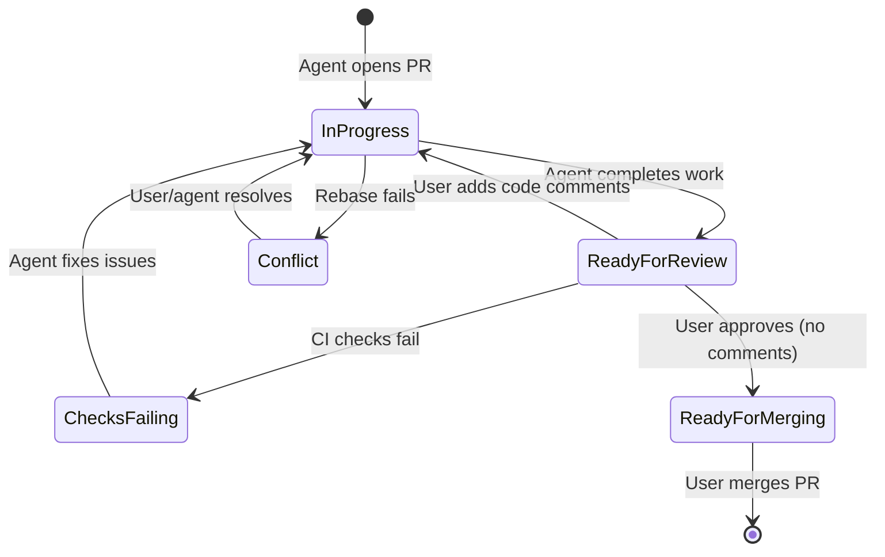

# TreeAgent

TreeAgent is a .NET application for managing software development workflows using Git, GitHub, and agentic AI tools like Claude Code. It models development as a tree where each node represents a feature or fix aligned with GitHub pull requests.

## Overview

TreeAgent provides a visual interface for planning and executing software development through AI agents. It manages:

- **Feature Tree**: Visualize past, present, and future pull requests as a tree structure
- **Multiple Projects**: Work on multiple repositories simultaneously
- **Git Worktrees**: Automatically manage worktrees for each feature branch
- **Claude Code Agents**: Spawn and manage headless Claude Code instances
- **Message Persistence**: Store all agent communications in SQLite

## Features

- Tree-based visualization of feature development
- Sync with GitHub pull requests (open, closed, merged)
- Plan future features before development begins
- Drill down into agent message streams
- Real-time updates via SignalR
- Custom system prompts with template variables
- Color-coded feature status:
  - Blue: Merged
  - Red: Cancelled
  - Yellow: In development
  - Green: Ready for review
  - Grey: Future/planned

## Technology Stack

- **.NET 8+**: Core runtime
- **Blazor Server**: Web frontend with SSR
- **SQLite + EF Core**: Persistence
- **SignalR**: Real-time updates
- **Claude Code CLI**: AI agent
- **Tailscale**: Optional secure remote access

## Getting Started

### Prerequisites

- .NET 8 SDK or later
- Git
- Claude Code CLI installed and configured
- GitHub personal access token (for PR synchronization)

### Installation

```bash
git clone https://github.com/your-org/TreeAgent.git
cd TreeAgent
dotnet restore
dotnet build
```

### Configuration

Set the following environment variables before running:

| Variable | Description | Default |
|----------|-------------|---------|
| `TREEAGENT_DB_PATH` | Path to SQLite database | `treeagent.db` |
| `GITHUB_TOKEN` | GitHub personal access token for PR operations | (required for GitHub sync) |
| `TREEAGENT_WORKTREE_ROOT` | Base directory for worktrees | (uses project path) |
| `CLAUDE_CODE_PATH` | Path to Claude Code CLI executable | (uses PATH) |

Example:
```bash
export GITHUB_TOKEN="ghp_your_token_here"
export TREEAGENT_DB_PATH="/data/treeagent.db"
```

### Running

```bash
dotnet run --project src/TreeAgent.Web
```

The application will be available at `https://localhost:5001` (or the configured port).

## Usage Guide

### Managing Projects

1. **Create a Project**: Navigate to the Projects page and click "Create Project"
2. **Configure Repository**: Enter the local Git repository path and optionally configure GitHub integration (owner/repo)
3. **Set Default Branch**: Specify the main branch name (e.g., `main` or `master`)

### Working with Features

1. **View Feature Tree**: Click on a project to see its feature tree
2. **Create a Feature**: Click "Add Feature" to create a new planned feature
   - Enter title, description, and branch name
   - Optionally set a parent feature to create hierarchical relationships
3. **Sync with GitHub**: Use the "Sync" button to import existing pull requests
4. **Start Development**: Click "Start" on a feature to:
   - Create a Git worktree automatically
   - Spawn a Claude Code agent
   - Begin development in isolation

### Managing Agents

1. **View Agents**: Navigate to the Agents dashboard to see all active agents
2. **Monitor Messages**: Click on an agent to view its message stream in real-time
3. **Stop Agents**: Use the "Stop" button to gracefully terminate an agent
4. **Custom Prompts**: Configure system prompts per feature or use project-level defaults

### System Prompts

TreeAgent supports customizable system prompts with template variables:

| Variable | Description |
|----------|-------------|
| `{{ProjectName}}` | Name of the current project |
| `{{FeatureTitle}}` | Title of the feature being worked on |
| `{{FeatureDescription}}` | Description of the feature |
| `{{BranchName}}` | Git branch name |
| `{{WorktreePath}}` | Path to the worktree directory |

Create prompt templates in the Prompt Templates page to reuse across features and projects.

### Pull Request Workflow

TreeAgent organizes development as a continuous chain of pull requests across three time stages:

#### Time Dimension

Each pull request has a calculated time value `t` based on its position in the workflow. This value is not stored but computed dynamically:

- **Past (`t <= 0`)**: Merged/closed PRs. The value is calculated from merge order - most recent merge has `t = 0`, older PRs have negative values (`t = -1`, `t = -2`, etc.).
- **Present (`t = 1`)**: All currently open PRs have `t = 1`. Multiple PRs can exist in parallel at this stage.
- **Future (`t > 1`)**: Planned changes stored in `ROADMAP.json`. The value is calculated from the change's depth in the tree structure.

#### PR Status Workflow



| Status | Color | Description |
|--------|-------|-------------|
| In Progress | Yellow | Agent is actively working on the PR |
| Ready for Review | Flashing Yellow | Agent completed, awaiting user review |
| Checks Failing | Red | CI/CD checks have failed |
| Conflict | Orange | Rebase failed due to merge conflicts |
| Ready for Merging | Green | Approved and ready to merge |
| Merged | Purple | PR has been merged (past) |
| Closed | Red | PR was closed without merging (past) |

#### Automatic Rebasing

When a PR is merged, all other open PRs (`t = 1`) are automatically rebased onto the new main branch HEAD. This keeps all parallel branches up-to-date and ensures clean merges.

#### Branch Naming Convention

Branches follow the pattern: `{group}/{type}/{id}`
- `group`: Project or component (e.g., `core`, `web`, `services`)
- `type`: Change type (`feature`, `bug`, `refactor`, `docs`, `test`, `chore`)
- `id`: Short identifier describing the change

Examples: `core/feature/pr-time-dimension`, `web/bug/fix-status-colors`

#### Future Changes (ROADMAP.json)

Planned changes are stored in `ROADMAP.json` on the default branch:
- Each change includes `id`, `group`, `type`, `title`, and `instructions`
- Changes are organized as a recursive tree structure with nested children
- When an agent starts work on a future change, it becomes a current PR

#### Plan Update PRs

When a PR contains *only* modifications to `ROADMAP.json` (planning changes without code), it is treated as a special `plan-update` group PR. These PRs:
- Contain only modifications to the roadmap file (no code changes)
- Must be merged before other PRs
- Ensure the single source of truth for planning is always consistent

Note: When a future change is promoted to a current PR, the `ROADMAP.json` is also updated to remove that change. This is a normal PR, not a plan-update PR, since it includes code changes.

#### GitHub Sync

- **Past PRs**: Imported from closed/merged PRs with correct time ordering
- **Current PRs**: Synced with open PRs, status reflects review/check state
- **Create PRs**: Push branches and create PRs directly from TreeAgent

## API Endpoints

### Health Check

```
GET /health
```

Returns application health status including database connectivity and process manager state.

## Real-time Updates

TreeAgent uses SignalR for real-time updates. Connect to `/hubs/agent` for:
- Agent message streaming
- Agent status changes
- Feature status changes

## Documentation

- [SPECIFICATION.md](SPECIFICATION.md) - Technical specification
- [ROADMAP.md](ROADMAP.md) - Development roadmap

## Development

### Running Tests

```bash
dotnet test
```

### Creating Database Migrations

```bash
cd src/TreeAgent.Web
dotnet ef migrations add <MigrationName>
```

Migrations are applied automatically on startup.

## License

MIT
