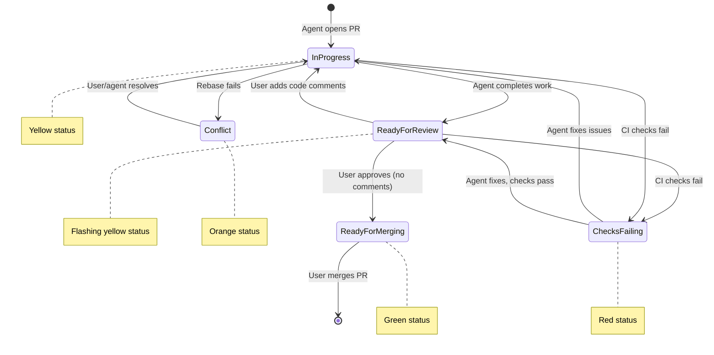

# TreeAgent Development Roadmap

This document outlines the development roadmap for the Pull Request Workflow feature.

## Overview

TreeAgent manages past, present, and future pull requests in a unified workflow. Past and present PRs form a single chain on the main branch, while future changes branch into a tree structure. As PRs are merged, parallel branches are "zipped" back into the trunk through automatic rebasing.

---

## Pull Request Workflow

### Time Dimension

Each pull request has a calculated time value `t` based on its position in the workflow. This value is not stored but computed dynamically:

- `t < 0`: Past (merged/closed) PRs. Calculated from merge order - most recent merge has `t = 0`, older PRs have negative values.
- `t = 0`: Most recently merged PR (head of main)
- `t = 1`: All currently open PRs. Multiple PRs can exist in parallel at this stage.
- `t > 1`: Future planned changes (stored in ROADMAP.json). Calculated from tree depth.

### Current PR Status Workflow



### Status Definitions

| Status | Color | Description |
|--------|-------|-------------|
| In Progress | Yellow | Agent is actively working on the PR |
| Ready for Review | Flashing Yellow | Agent completed, awaiting user review |
| Checks Failing | Red | CI/CD checks have failed |
| Conflict | Orange | Rebase failed due to merge conflicts |
| Ready for Merging | Green | Approved and ready to merge |
| Merged | Purple | PR has been merged (past) |
| Closed | Red | PR was closed without merging (past) |

### Conflict Resolution

When automatic rebasing fails due to conflicts, the PR enters "Conflict" status. The user can then:
- Manually rebase or merge the changes
- Spawn an agent to attempt automatic conflict resolution

### Closed PR Ordering

Closed (not merged) PRs are assigned a `t` value based on the PR they were closed closest to in time, placing them in the timeline relative to when they were abandoned.

---

## ROADMAP.json Schema

Future changes are stored in a `ROADMAP.json` file on the default branch. The structure is a recursive tree where each change can have nested children. The time value `t` is calculated from tree depth (root children have `t = 2`, their children have `t = 3`, etc.).

```json
{
  "$schema": "http://json-schema.org/draft-07/schema#",
  "title": "TreeAgent Roadmap",
  "type": "object",
  "properties": {
    "version": {
      "type": "string",
      "description": "Schema version"
    },
    "lastUpdated": {
      "type": "string",
      "format": "date-time",
      "description": "ISO 8601 timestamp of last update"
    },
    "changes": {
      "type": "array",
      "items": {
        "$ref": "#/definitions/futureChange"
      },
      "description": "Root-level future changes (t = 2)"
    }
  },
  "required": ["version", "changes"],
  "definitions": {
    "futureChange": {
      "type": "object",
      "properties": {
        "id": {
          "type": "string",
          "pattern": "^[a-z0-9-]+$",
          "description": "Short identifier for the change (used in branch naming)"
        },
        "group": {
          "type": "string",
          "description": "Project/component group this change belongs to"
        },
        "type": {
          "type": "string",
          "enum": ["feature", "bug", "refactor", "docs", "test", "chore"],
          "description": "Type of change"
        },
        "title": {
          "type": "string",
          "description": "Short title describing the change"
        },
        "description": {
          "type": "string",
          "description": "Detailed description of the change"
        },
        "instructions": {
          "type": "string",
          "description": "Implementation instructions for agents (more specific for changes closer to root)"
        },
        "priority": {
          "type": "string",
          "enum": ["high", "medium", "low"],
          "description": "Priority level"
        },
        "estimatedComplexity": {
          "type": "string",
          "enum": ["small", "medium", "large"],
          "description": "Estimated implementation complexity"
        },
        "children": {
          "type": "array",
          "items": {
            "$ref": "#/definitions/futureChange"
          },
          "description": "Nested child changes that depend on this change"
        }
      },
      "required": ["id", "group", "type", "title"]
    }
  }
}
```

### Branch Naming Convention

Branches follow the pattern: `{group}/{type}/{id}`

Examples:
- `core/feature/pr-time-dimension`
- `web/bug/fix-status-colors`
- `services/refactor/github-sync`

---

## Data Architecture

TreeAgent uses a hybrid data architecture with clear separation of concerns:

| Data Type | Source of Truth | Storage |
|-----------|-----------------|---------|
| Past PRs | GitHub | Read from GitHub API (merged/closed PRs) |
| Current PRs | GitHub | Read from GitHub API (open PRs) |
| Future Changes | ROADMAP.json | Read from file in repository |
| Agent Messages | SQLite | EF Core database |

**Key principle**: PR and future change data is derived from GitHub and ROADMAP.json respectively. The SQLite database (EF Core) is used *only* for storing agent communication messages and related metadata. This ensures GitHub remains the single source of truth for PR state and the repository itself holds the roadmap.

---

## Implementation Plan

This implementation follows TDD principles: write failing tests first, then implement to make them pass.

### Phase 1: Data Model and Schema

#### 1.1 Define PR Status Types

**Tests:**
- `PullRequestStatus_AllStatusesHaveCorrectColors`
- `PullRequestStatus_CanCalculateTimeFromMergeOrder`
- `PullRequestStatus_OpenPRsAlwaysHaveTimeOne`

**Implementation:**
- Create `PullRequestStatus` enum: `InProgress`, `ReadyForReview`, `ChecksFailing`, `ReadyForMerging`, `Merged`, `Closed`
- Create `PullRequestInfo` model for GitHub PR data (not persisted to EF Core)
- Create helper methods to calculate `t` value from PR position

#### 1.2 Create ROADMAP.json Parser

**Tests:**
- `RoadmapParser_ValidJson_ParsesAllChanges`
- `RoadmapParser_InvalidJson_ThrowsValidationException`
- `RoadmapParser_MissingRequiredFields_ThrowsValidationException`
- `RoadmapParser_ParsesNestedChildren_AsTree`
- `RoadmapParser_CalculatesTimeFromTreeDepth`

**Implementation:**
- Create `RoadmapChange` model matching schema with recursive `Children` property
- Create `RoadmapParser` service with JSON schema validation
- Add file watcher for ROADMAP.json changes
- Implement `t` value calculation from tree depth

### Phase 2: GitHub Integration Refactor

#### 2.1 Past PR Synchronization

**Tests:**
- `GitHubSync_MergedPRs_OrderedByMergeTime`
- `GitHubSync_ClosedPRs_OrderedByCloseTime`
- `GitHubSync_CalculatesTimeFromMergeOrder`
- `GitHubSync_MostRecentMerge_HasTimeZero`

**Implementation:**
- Modify `GitHubService` to fetch merged/closed PRs with merge timestamps
- Calculate `t` values dynamically based on merge order (most recent = 0, older = negative)
- Return PR data as read-only models (not persisted to database)

#### 2.2 Current PR Status Tracking

**Tests:**
- `CurrentPR_NewPR_HasInProgressStatus`
- `CurrentPR_AgentComplete_HasReadyForReviewStatus`
- `CurrentPR_ReviewComments_ReturnsToInProgress`
- `CurrentPR_ChecksFailing_HasChecksFailingStatus`
- `CurrentPR_Approved_HasReadyForMergingStatus`
- `CurrentPR_AllOpenPRs_HaveTimeOne`

**Implementation:**
- Track PR review state from GitHub webhooks or polling
- Detect CI check status via GitHub API
- Implement status transition logic matching the state diagram
- All open PRs always have calculated `t = 1`

#### 2.3 Automatic Rebasing

**Tests:**
- `AutoRebase_OnMerge_RebasesAllOpenPRs`
- `AutoRebase_ConflictDetected_ReportsConflict`
- `AutoRebase_Success_UpdatesAllBranches`

**Implementation:**
- Detect when a PR is merged (t=1 -> t=0)
- Trigger rebase of all other t=1 branches onto new main HEAD
- Handle rebase conflicts with user notification
- Update GitHub branches after successful rebase

### Phase 3: Future Changes (ROADMAP.json)

#### 3.1 Read and Display Future Changes

**Tests:**
- `FutureChanges_LoadFromRoadmap_DisplaysInTree`
- `FutureChanges_NestedChildren_DisplaysHierarchy`
- `FutureChanges_CalculatesTimeFromDepth`
- `FutureChanges_GroupsDisplayedCorrectly`

**Implementation:**
- Load ROADMAP.json on startup and file change
- Display future changes in feature tree with recursive children
- Calculate `t` values from tree depth (root = 2, children = 3, etc.)
- Group changes visually by the `group` field

#### 3.2 Promote Future Change to Current PR

**Tests:**
- `PromoteChange_CreatesWorktree_WithCorrectBranchName`
- `PromoteChange_CreatesPR_WithChangeDetails`
- `PromoteChange_RemovesFromRoadmap_UpdatesTree`
- `PromoteChange_PromotesChildren_ToParentLevel`

**Implementation:**
- When agent starts work on a future change, create worktree with branch `{group}/{type}/{id}`
- Open PR with title and description from the change
- Remove the change from ROADMAP.json and promote its children to the parent level
- ROADMAP.json update is included in the PR (not a separate plan-update PR)

#### 3.3 Plan Update PRs

**Tests:**
- `PlanUpdate_OnlyRoadmapChanges_UsesPlanUpdateGroup`
- `PlanUpdate_MustMergeFirst_BeforeOtherPRs`
- `PlanUpdate_ValidatesSchema_BeforeMerge`

**Implementation:**
- Detect PRs that only modify ROADMAP.json (no code changes)
- Use `plan-update` as the group in branch naming
- Block merging of other PRs until plan-update PRs are merged
- Validate ROADMAP.json schema on PR creation

### Phase 4: UI Updates

#### 4.1 Timeline Visualization

**Tests:**
- `Timeline_PastPRs_ShowsMergeOrder`
- `Timeline_CurrentPRs_ShowsParallelBranches`
- `Timeline_FutureChanges_ShowsTree`
- `Timeline_StatusColors_MatchDefinitions`

**Implementation:**
- Redesign feature tree to show time dimension
- Add visual distinction between past (linear), current (parallel), future (tree)
- Apply correct status colors per the status definitions table

#### 4.2 Group Visualization

**Tests:**
- `Groups_PRsGroupedByComponent`
- `Groups_FilterByGroup_ShowsOnlyRelated`
- `Groups_ColorCodedByGroup`

**Implementation:**
- Add visual group indicators for PRs and changes
- Allow filtering the view by group
- Color-code or tag items by their group

#### 4.3 Status Workflow UI

**Tests:**
- `StatusUI_InProgress_ShowsYellow`
- `StatusUI_ReadyForReview_ShowsFlashingYellow`
- `StatusUI_ChecksFailing_ShowsRed`
- `StatusUI_ReadyForMerging_ShowsGreen`

**Implementation:**
- Add flashing animation for Ready for Review status
- Update color scheme to match status definitions
- Add status transition buttons where applicable

### Phase 5: Agent Integration

#### 5.1 Agent Status Updates

**Tests:**
- `Agent_StartWork_PRMovesToInProgress`
- `Agent_CompleteWork_PRMovesToReadyForReview`
- `Agent_RoadmapOnlyChange_CreatesPlanUpdatePR`

**Implementation:**
- Agent lifecycle updates PR status automatically
- Detect agent completion and transition to Ready for Review
- When agent modifies *only* ROADMAP.json (no code), create plan-update group PR

#### 5.2 Review Comment Handling

**Tests:**
- `ReviewComments_Received_SpawnsNewAgent`
- `ReviewComments_Agent_MovesToInProgress`
- `ReviewComments_Resolved_MovesToReadyForReview`

**Implementation:**
- Detect new review comments on Ready for Review PRs
- Spawn new agent to address comments
- Track comment resolution status

---

## Future Considerations

Features for potential future development, organized by priority:

### High Priority

- **Interactive Tree Editing**: Drag-and-drop reordering and reparenting of features in the tree view
- **Agent Collaboration**: Enable multiple agents to work on related features with shared context
- **Auto-merge Pipeline**: Automated PR merging with conflict resolution and CI integration

### Medium Priority

- **Code Review Integration**: AI-assisted code review workflow with inline comments and suggestions
- **Metrics Dashboard**: Development velocity tracking, agent performance metrics, and cost analysis
- **Multi-user Support**: Team features with role-based access control and user authentication
- **Notification System**: Email/Slack notifications for agent completions, PR status changes, and errors

### Exploratory

- **Protocol Layer (ACP/AG-UI/MCP)**: Standardized protocols for agent interoperability with other AI tools
- **Plugin Architecture**: Extensibility for custom integrations and workflows
- **Mobile Companion App**: Monitor agents and approve PRs from mobile devices
- **Self-hosting Guide**: Docker/Kubernetes deployment documentation

---

## Contributing

Contributions are welcome. Please see the [SPECIFICATION.md](SPECIFICATION.md) for technical details and architecture overview before submitting pull requests.
